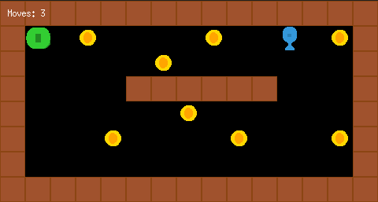

# Mini Dungeon Escape
<p align="center">
  
</p>

## Description

Mini Dungeon Escape is a 2D game developed in C using the MiniLibX graphics library. The player navigates a character through a dungeon map, collecting items with the objective of reaching an exit point. The game features map loading from `.ber` files, comprehensive map validation, and basic game mechanics.

## Features

*   **2D Map Rendering:** Displays the game map including walls, floor, player, collectibles, and exit.
*   **Player Movement:** Allows the player to move around the map.
*   **Collectible Items:** Player must collect all items before being able to exit.
*   **Map Validation:**
    *   Ensures the map is rectangular.
    *   Verifies that the map is enclosed by walls.
    *   Checks for valid map elements (Player 'P', Collectible 'C', Exit 'E', Wall '1', Floor '0').
    *   Confirms that there is a valid path for the player to reach all collectibles and the exit.
*   **Custom Map Loading:** Loads game maps from user-provided `.ber` files.
*   **Event Handling:** Manages keyboard inputs for player movement and window events (e.g., closing the window).

## Project Structure

The project is organized into the following main directories:

*   `srcs/`: Contains all the C source files.
    *   `main/`: Entry point and main game execution logic.
    *   `game_manager/`: Handles game environment setup, event processing, and rendering logic.
    *   `map_manager/`: Manages map file reading, data parsing, validation, and element identification.
    *   `utils/`: Provides utility functions for string manipulation, memory deallocation, and output.
*   `includes/`: Contains the header files for the project (e.g., `mini_dungeon_escape.h`).
*   `mlx/`: Contains the MiniLibX graphics library files.
*   `maps/`: (Recommended directory for storing `.ber` map files - you might need to create this)

## Getting Started

### Prerequisites

*   A C compiler (e.g., `clang` as specified in the Makefile).
*   `make` utility.
*   The X Window System libraries (libXext, libX11) required by MiniLibX.

### Compilation

1.  Clone the repository (if applicable).
2.  Navigate to the project's root directory.
3.  Run the `make` command:
    ```bash
    make
    ```
    This will compile the source files and create the executable `mini_dungeon_escape`.

### Running the Game

To run the game, execute the compiled program from the terminal, providing the path to a valid `.ber` map file as an argument:

```bash
./mini_dungeon_escape path/to/your_map.ber
```

Example:
```bash
./mini_dungeon_escape maps/example_map.ber
```

## Makefile Commands

*   `make` or `make all`: Compiles the project.
*   `make clean`: Removes object files (`.o` files).
*   `make fclean`: Removes object files and the executable.
*   `make re`: Re-compiles the project (equivalent to `fclean` then `all`).

## Map File Format (`.ber`)

The map files must adhere to the following rules:

1.  The file must have a `.ber` extension.
2.  The map must be rectangular, composed of only the following characters:
    *   `1`: Wall
    *   `0`: Empty space (Floor)
    *   `C`: Collectible
    *   `E`: Map exit
    *   `P`: Player's starting position
3.  The map must be closed/surrounded by walls (`1`).
4.  There must be at least one collectible (`C`), exactly one exit (`E`), and exactly one player starting position (`P`).
5.  There must be a valid path from the player's starting position to all collectibles and then to the exit.

---

## Author

*   hosu-kim

## License

This project is licensed under the MIT License.
